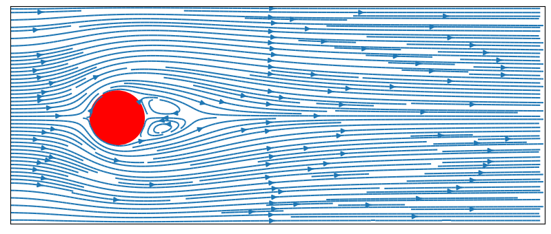
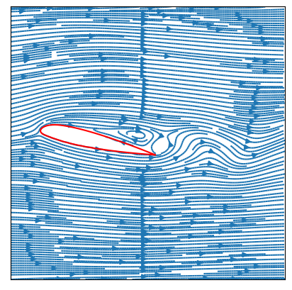

# Lattice Boltzmann Method, Thực hành CFD với Python!

Phương pháp lưới Boltzmann (LBM) ngày càng được sử dụng rộng rãi để mô phỏng chuyển động của lưu chất nhờ sự đơn giản trong thuật toán. Phần 'Thực hành CFD với Python!' này sẽ  giới thiệu các kiến thức cơ bản của LBM, code và ví dụ.

**Dòng chảy Poiseuille**

**Lid driven cavity**

**Cylinder**

**NACA23012**

**Face**

**Whale**

